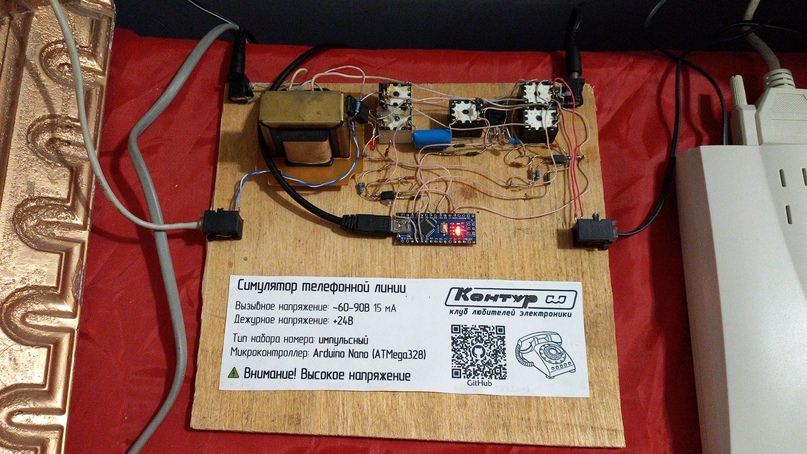

# Простой симулятор телефонной линии

> [!WARNING]
> Тестовый образец! Используйте на свой страх и риск

[Просмотреть схему...](Schematic.pdf)


Максимально упрощённый (с точки зрения электрической схемы) соединитель двух проводных телефонов с максимально возможным приближением к функциям реальной АТС.
Достигнуто за счёт использования **Arduino Nano** в основе проекта.

Специально для [клуба любителей электроники "Контур"](https://vk.com/ssau_kontur)

**ВНИМАНИЕ!** Тоновый набор не поддерживается! Набор возможен либо с дискового телефона, либо с телефонного аппарата/модема в режиме импульсного набора.

### Функции
- Посылка вызова с гудком КПВ
- Считывание импульсного набора и проверка введённого номера
- Звуковые сигналы "занято", "линия занята"[^1], "неправильно набран номер"
- Звуковой сигнал предупреждения о снятой длительное время трубке
- Установка номеров линий через COM-порт

### Примеры применения
- Интерком на два телефона
- Организация "игрушечной" телефонии для детей
- Соединение двух dial-up модемов (в ностальгических целях)

### Известные проблемы
- Проблемы с одновременным воспроизведением сигналов в обеих трубках

### Конфигурация
#### Файл config.h
```cpp
#define NUM_LENGTH 6            // макс длина номера линии
#define ANSWER_WAIT_MS 10000    // макс время ожидания ответа на звонок до сигнала "занято"
#define DIAL_WAIT_MS 10000      // макс время ожидания набора номера после снятия трубки

#define LINE_READY_OR_BUSY 425      // частота звуковых сигналов КПВ и "занято"
#define OFF_HOOK_WARNING 950        // частота звукового сигнала предупреждения о снятой трубке
#define BUSY_SIG_INTERVAL 400       // интервал между воспроизведением тонов в сигнале "занято"
#define OVERLOAD_SIG_INTERVAL 150   // интервал между воспроизведением тонов в сигнале "линия занята"

// пины считывания напряжений на линиях (аналоговые)
#define LINE1_PROBE A0
#define LINE2_PROBE A1
// пины воспроизведения тонов на линиях (с поддержкой ШИМ)
#define LINE1_SIGNAL 9
#define LINE2_SIGNAL 10
// пины подачи сигналов на реле звонков
#define LINE1_RING 4
#define LINE2_RING 5
// пин подачи сигнала на реле соединения линий
#define LINE_CONNECT 6

#define OFF_HOOK_ADC 900 // значение считывания напряжения на линии, ниже которого трубка считается снятой
```

#### Установка номеров линий
1. Подключиться к Arduino через COM-порт со скоростью 38400 бод.
2. Ввести в терминал цифры желаемого номера телефона. Максимальное количество цифр - значение `NUM_LENGTH` в файле конфигурации.
3. После ввода номера ввести английскую букву A для установки введённого номера на линию 1, либо букву B для его установки на линию 2.
4. В случае успеха в терминал будет выведено `Numbers set` и номера обеих линий.

При вводе в терминал чего-либо, кроме цифр и символов A и B, курсор вернётся в начальное положение и придётся начать ввод заново.
Посторонние символы и лишние цифры (при превышении `NUM_LENGTH`) не отображаются в терминале при вводе.

Примеры ввода команд:
*для значения* `NUM_LENGTH` = 6
- 12123A - на линию 1 будет установлен номер 12123
- 15255B - на линию 2 будет установлен номер 15255
- 12G3167B - на линию 2 будет установлен номер 3167 (т.к. после постороннего символа ввод был сброшен)
- 177136712A - на линию 1 будет установлен номер 177136 (всё, что превысило длину `NUM_LENGTH`, было проигнорировано)

Ввод постороннего символа можно использовать для сброса при неправильном вводе желаемого номера.

[^1]: если на одной из сторон уже снята трубка, на второй стороне при снятии трубки будет воспроизведен сигнал "линия занята"